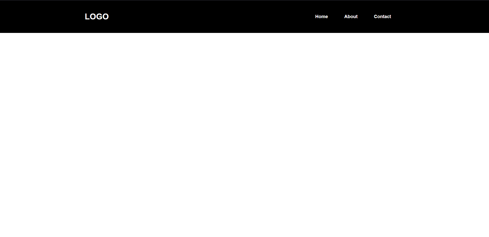

<h1 align="center">Next.js Chakra UI Template</h1>

<div align="center">

</div>

<div align="center">

[](https://www.codefactor.io/repository/github/imadatyatalah/cna-chakra-ui-template)
[](https://github.com/imadatyatalah/cna-chakra-ui-template/blob/main/LICENSE)
[](https://github.com/imadatyatalah/cna-chakra-ui-template/stargazers)
[](https://github.com/imadatyatalah/cna-chakra-ui-template/network/members)

</div>

### Built With

- [Next.js](https://nextjs.org/)
- [Chakra UI](https://chakra-ui.com/)


### Screenshot



## Getting Started

Clone the repository (FrontEnd) that was created on our account and run the following commands in the terminal:

```bash
# Installing yarn
sudo npm install -g yarn
# Making sure yarn is installed
yarn --version
# installing the libraries needed for the project
yarn install
# Starting the project
yarn dev
```

The web app is now running at [`http://localhost:3000`](http://localhost:3000)!

## License

Distributed under the MIT License. See [`LICENSE`](https://github.com/imadatyatalah/cna-chakra-ui-template/blob/main/LICENSE) for more information.

## The web app
So after running the previous commands and the web app is running in the browser, thats the first thing you will see:

### Landing Page


So this landing page gives a brief summary about what the web app is all about. If the teacher wants to log in, then the teacher needs to click the Log-in on the top right, and after that the teacher will be moved to this page:

### Teacher log in page:

To log in as a teacher Please type `123` in the username textfield and `abshir` for the password.

After you successfully log in you will be moved to this page:
### Teacher Dashboard page:

In this page you will see the teacher's name, their department, and also the consultation hours, on the right hand side you will see a bar graph:
`y-axis` = Number of classes per day
`x-axis` = The days in the week
